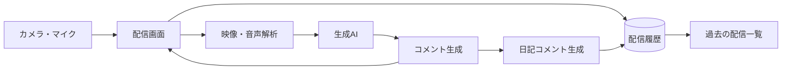

# チーム名

**403 Forbidden**

読み：よんまるさん フォービドゥン、HTTPステータスコードの一つで、ログインしていても権限がないためページを閲覧できない状態を意味する。

# プロダクト名

**AI Streaming『あいづち | AIZUCHI』**

  

  

  <strong>オーディエンスはAI</strong> 
  ひとりの時間をAI視聴者でにぎやかに、あなただけのAIライブ配信体験を。

## 概要

AI Streaming『あいづち | AIZUCHI』は、自分の映像をインターネット上へ公開せず、AIからリアルタイムの反応を受け取れる疑似ライブ体験サービスである。カメラとマイクから得た情報を生成AIが解析し、利用者の行動と周囲の状況に合うコメントを生成する。利用者が声を返すと、その内容を受けた新しい反応が続き、誰にも配信していないのに大勢の視聴者と同じ時間を共有しているような感覚が生まれる。

ひとりの時間を孤独感を感じる時間にしないことが、本プロダクトの目標である。

## デモ

- 発表資料URL：[あいづち発表資料を見る](https://github.com/user-attachments/files/30640531/_.pdf)
- 起動方法：`backend`ディレクトリに入った状態で、`npm start`を打ち込んでサーバーを起動する。

## システム構成

利用者のカメラとマイクから得た情報を解析し、その結果を生成AIへ送信する。生成されたコメントは配信画面へ順次反映される。利用者の音声入力も解析対象となり、返答内容に応じた追加コメントを生成する。配信終了後は配信時間、視聴者数、コメント数を保存し、AIが作成した日記コメントと合わせて過去の配信一覧から閲覧できる。

コメントの表示方法とコメント履歴は別の状態として管理する。YouTube風の表示からニコニコ動画風の表示へ切り替えても、生成済みのチャットは保持される。ニコニコ動画風の表示はONとOFFをいつでも変更でき、配信の流れを止めずに好みの見せ方を選択できる。

## 背景・課題

ある調査結果によると、日本人の約4割が孤独感を感じている。この孤独感を解消する一つの方法にライブ配信が挙げられると考えた。ライブ配信は視聴者との対話により”他者とつながっている感覚・一体感”を持つことができ、孤独感解消にぴったりだ。またライブ配信は昨今凄まじい人気を博しており、一度は「配信をしてみたい」と思ったことはないだろうか。しかしながら、配信を始めても視聴者が集まるとは限らない。自分の映像を不特定多数へ公開することに抵抗を感じる人もいる。反応が欲しいと思っていても、公開への不安が配信を始める壁となる。
理想は、一人で気軽に行動できる状態を保ちながら、その場に合う反応を受け取り、誰かと同じ時間を共有している感覚を得られることである。

### 課題

**利用者の映像を公開せず、生成AIがその場に合う自然なコメントを継続して返せる環境をつくる。**

映像と音声の解析結果を基に生成AIがコメントを作り、実際の配信に近い間隔で画面へ流すことを課題とした。反応の種類、視聴者の個性、配信後の振り返りまで設計することで、疑似的なライブ配信体験を継続して楽しめる環境を目指している。

## 主な機能

- **新規ユーザーのユーザー名設定**  
  初めて利用するユーザーは、配信を始める前に自分のユーザー名を設定できる。登録した名前は配信中の呼びかけと日記コメントに反映され、利用者本人に向けた反応であることが伝わりやすくなる。

- **目的を選べるスタート画面**  
  スタート画面では、**配信を始める**、**過去の配信を振り返る**の二つから目的を選択できる。入口を明確に分けることで、利用者が迷わず次の操作へ進める。

- **状況に合ったリアルタイムコメント**  
  カメラとマイクから得た情報を生成AIが解析し、利用者の行動と周囲の変化に合うコメントを生成する。利用者が声で返答すると、その内容を受けた追加コメントが流れ、疑似的な会話が続く。

- **質問に答える視聴者たち**  
  ユーザーが視聴者に質問を投げかけると質問に答える。（例：Q「朝食何食べた？」A「卵焼き」など）

- **表示を切り替えても消えないチャット**  
  YouTube風のチャット表示から、ニコニコ動画風の画面表示へ切り替えられる。ニコニコ動画風の表示はONとOFFをいつでも変更できる。表示方法を変更してもチャット履歴を保持するため、それまでの盛り上がりが失われない。

- **配信を記録する日記コメント**  
  配信終了後、AIがその時間を振り返る日記コメントを作成する。配信時間、視聴者数、コメント数を記録し、良かった点をフィードバックする。次の配信へ生かせる改善点も残るため、楽しさと振り返りを両立できる。

- **過去の配信一覧**  
  これまでの配信を一覧で確認できる。各配信の日記コメントも閲覧できるため、その日に起きたこととAIから受け取った反応を後から振り返れる。

## 工夫した点・こだわった点

- **誰にも公開しないライブ体験**  
  映像を不特定多数へ公開せず、利用者の端末で体験が完結する構成を重視した。公開への抵抗を減らしながら、ライブ配信の楽しさを残している。

- **表示状態と会話状態の分離**  
  YouTube風からニコニコ動画風へ切り替えた際、チャットがリセットされる問題を解決した。画面の見せ方とコメント履歴を別に管理し、表示を変更しても会話の流れが残る設計とした。

- **配信後まで続く体験**  
  配信中のコメントだけで終わらせず、配信時間、視聴者数、コメント数を日記コメントとして残す。また良かった点と改善点（AIからのフィードバック）を後から確認できるため、一人で過ごした時間が自分だけの記録として積み重なる。

## 工夫した点・こだわった点

- **誰にも公開しないライブ体験**  
  映像を不特定多数へ公開せず、利用者の端末で体験が完結する構成を重視した。公開への不安感を減らしながら、ライブ配信の楽しさを創出している。

- **表示状態と会話状態の分離**  
  YouTube風からニコニコ動画風へ切り替えた際、チャットがリセットされる問題を解決した。画面の見せ方とコメント履歴を別に管理し、表示を変更しても会話の流れが残る設計とした。

- **配信後まで続く体験**  
  配信中のコメントだけで終わらせず、配信時間、視聴者数、コメント数を日記コメントとして残す。また良かった点と改善点（AIからのフィードバック）を後から確認できるため、一人で過ごした時間が自分だけの記録として積み重なる。

## 使用技術

  フロントエンド

  - HTML
      - 画面構造、モーダル、配信画面、チャット欄、アーカイブ画面

  - CSS
      - レスポンシブ対応、配信画面UI、チャット表示、ニコニコ風コメント演出、モーダルデザイン

  - JavaScript
      - カメラ・マイク制御
      - コメント表示
      - ニコニコ風コメントのON/OFF切り替え
      - 音声検知
      - 配信録画
      - アーカイブ保存・表示

  - Web APIs
      - MediaDevices API: カメラ・マイク取得
      - MediaRecorder API: 音声・映像の録音録画
      - Canvas API: 映像フレームの画像化
      - IndexedDB: 配信アーカイブ保存
      - localStorage: ユーザー名保存
      - Fetch API: backendとの通信

  バックエンド

  - Node.js
      - サーバー実行環境

  - Express
      - APIサーバー、静的ファイル配信

  - Multer
      - マイク音声ファイルの受信

  - dotenv
      - .env による環境変数管理

  - OpenAI SDK
      - OpenAI APIとの連携

  - JavaScript ES Modules
      - import/export を使ったモジュール構成

  AI / API

  - OpenAI API
      - 映像フレーム解析: gpt-4o-mini
      - コメント生成: gpt-4o-mini
      - 音声文字起こし: whisper-1
      - 配信振り返り生成: gpt-4o-mini

  - AIプロバイダー切り替え機構
      - .env の AI_PROVIDER で openai / custom を切り替え可能
      - providers/custom.js に自作AI APIを接続できる構成

## 今後の展望

今後は、利用者が好むコメントの雰囲気を学習し、配信を重ねるほど視聴者ごとの性格が育つ仕組みを目指す。前回も参加した視聴者が再び現れ、利用者の小さな変化に気づくようになれば、疑似ライブ配信はその場を盛り上げる機能から、一人の時間に寄り添う存在へ成長する。

コメントの安全性を保つ仕組みも改善し、アンチ系の視聴者が登場しても、利用者を傷つける表現は抑える。日記コメントには配信ごとの変化を反映し、過去の記録から自分の活動を振り返りやすくする。端末の違いに左右されず利用できる画面へ整え、日常の中で気軽に配信を始められるサービスを目指す。

## セットアップ方法

モデルのインストール方法等セットアップ方法に関しては、バックエンドの側により詳細に記したREADME.mdを置いております。そちらをご確認ください！

## メンバー

| 名前 | 担当 |
|------|------|
| 永井 駿矢（NAGAI Shunya） | README.md作成・発表資料作成・プレゼンテーション・一部フロントエンド・一部バックエンド |
| 宮本 英幸（MIYAMOTO Hideyuki） | AIモデル |
| 中林 涼（NAKABASHI Ryo） | バックエンド |
| 滝澤 寛正（TAKIZAWA Kansei） | フロントエンド |
