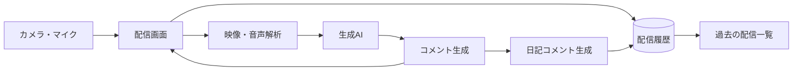

# チーム名

**403 Forbidden**

読み：よんまるさん フォービドゥン、HTTPステータスコードの一つで、ログインしていても権限がないためページを閲覧できない状態を意味する。

# プロダクト名

**AI Streaming『あいづち | AIZUCHI』**

<p align="center">
  
</p>

<p align="center">
  
</p>

<p align="center">
  <strong>オーディエンスはAI</strong><br>
  ひとりの時間をAIでにぎやかに、あなただけのAIライブ体験を。
</p>

## 概要

AI Streaming あいづち | AIZUCHI は、自分の映像をインターネット上へ公開せず、AIからリアルタイムの反応を受け取れる疑似ライブ配信サービスである。カメラとマイクから得た情報を生成AIが解析し、利用者の行動と周囲の状況に合うコメントを生成する。利用者が声を返すと、その内容を受けた新しい反応が続き、誰にも配信していないのに大勢の視聴者と同じ時間を共有しているような感覚が生まれる。

一人で過ごす自由を守りながら、誰かに見てもらえているようなにぎやかさを届ける。一人の時間を孤独な時間にしないことが、本プロダクトの目標である。

## デモ

- 発表資料URL：`ここにURLを記入`
- デモURL：`ここにURLを記入`
- デモ動画：`ここにURLを記入`
- スクリーンショット：`docs/images/demo-screen.png` に配置予定

スクリーンショットをリポジトリへ追加した後、次の一行をREADME.mdへ記載すると画像を表示できる。

```markdown

```

画像の横幅を指定して中央に配置する場合は、Markdown内でHTMLを使用できる。

```html
<p align="center">
  
</p>
```

## システム構成



利用者のカメラとマイクから得た情報を解析し、その結果を生成AIへ送信する。生成されたコメントは配信画面へ順次反映される。利用者の音声入力も解析対象となり、返答内容に応じた追加コメントを生成する。配信終了後は配信時間、視聴者数、コメント数を保存し、AIが作成した日記コメントと合わせて過去の配信一覧から閲覧できる。

コメントの表示方法とコメント履歴は別の状態として管理する。YouTube風の表示からニコニコ動画風の表示へ切り替えても、生成済みのチャットは保持される。ニコニコ動画風の表示はONとOFFをいつでも変更でき、配信の流れを止めずに好みの見せ方を選択できる。

## 背景・課題

一人で作業しているとき、自分の行動に対する反応をリアルタイムで得る方法として、実際のライブ配信が挙げられる。しかし、配信を始めても視聴者が集まるとは限らない。自分の映像を不特定多数へ公開することに抵抗を感じる人もいる。反応が欲しいと思っていても、公開への不安が配信を始める壁となる。

理想は、一人で気軽に行動できる状態を保ちながら、その場に合う反応を受け取り、誰かと同じ時間を共有している感覚を得られることである。

### 問題

**映像を公開せず、その場に合う反応をリアルタイムで受け取る手段が少ない。**

現状では、一人の気軽さを選ぶと反応を得にくく、ライブ配信を選ぶと公開への不安が生まれる。安心して一人で過ごせる現状と、誰かに反応してもらいたい理想との間に差がある。この現状と理想の差が、本プロダクトで解決したい問題である。

### 課題

**利用者の映像を公開せず、その場に合う自然なコメントを継続して返せる環境をつくる。**

問題となる差を埋めるには、映像を公開しない安心感を保ちながら、利用者の状況を理解して反応する仕組みが必要となる。そこで、映像と音声の解析結果を基に生成AIがコメントを作り、実際の配信に近い間隔で画面へ流すことを課題とした。反応の種類、視聴者の個性、配信後の振り返りまで設計することで、疑似的なライブ配信を継続して楽しめる環境を目指している。

## 主な機能

- **新規ユーザーの名前設定**  
  初めて利用するユーザーは、配信を始める前に自分のユーザー名を設定できる。登録した名前は配信中の呼びかけと日記コメントに反映され、利用者本人に向けた反応であることが伝わりやすくなる。

- **目的を選べるスタート画面**  
  スタート画面では、**配信を始める**、**過去の配信を振り返る**の二つから目的を選択できる。入口を明確に分けることで、利用者が迷わず次の操作へ進める。

- **状況に合ったリアルタイムコメント**  
  カメラとマイクから得た情報を生成AIが解析し、利用者の行動と周囲の変化に合うコメントを生成する。利用者が声で返答すると、その内容を受けた追加コメントが流れ、疑似的な会話が続く。

- **多種多様なコメント表現**  
  短文コメントに加え、熱量のある長文コメントも生成する。誤字脱字を含むコメント、一文字の `あ`、英字一文字の `i`もランダムに現れる。文章の長さと整い方を固定しないことで、実際の配信に近いコメント欄を再現する。

- **意見の異なる視聴者層**  
  信者系の視聴者は強い応援コメントを返し、アンチ系の視聴者は厳しい反応を返す。全員が同じ意見になる不自然さを抑え、コメント欄に温度差と人間らしさを生み出す。

- **個性のある視聴者名**  
  一般的な日本語名だけではなく、英語名、ネタ系の名前も登場する。コメント内容に視聴者名の個性が加わるため、本当に複数の人が参加しているような雰囲気が生まれる。

- **表示を切り替えても消えないチャット**  
  YouTube風のチャット表示から、ニコニコ動画風の画面表示へ切り替えられる。ニコニコ動画風の表示はONとOFFをいつでも変更できる。表示方法を変更してもチャット履歴を保持するため、それまでの盛り上がりが失われない。

- **配信を記録する日記コメント**  
  配信終了後、AIがその時間を振り返る日記コメントを作成する。配信時間、視聴者数、コメント数を記録し、良かった点をフィードバックする。次の配信へ生かせる改善点も残るため、楽しさと振り返りを両立できる。

- **過去の配信一覧**  
  これまでの配信を一覧で確認できる。各配信の日記コメントも閲覧できるため、その日に起きたこととAIから受け取った反応を後から振り返れる。

## 工夫した点・こだわった点

- **誰にも公開しないライブ体験**  
  映像を不特定多数へ公開せず、利用者の端末と限定された処理環境で体験が完結する構成を重視した。公開への抵抗を減らしながら、ライブ配信の楽しさを残している。

- **整いすぎないコメント表現**  
  生成AIの文章は、正確で長さが揃いすぎると人工的に見えやすい。そこで、短い反応、誤字脱字、一文字だけの反応を混ぜ、実際のコメント欄に見られる不規則さを再現した。

- **視聴者ごとに異なる反応**  
  応援する視聴者だけでコメント欄を構成せず、厳しい意見を持つ視聴者も登場させた。視聴者名と使用言語にも違いを持たせ、複数の人が同じ配信を見ているような存在感をつくっている。

- **表示状態と会話状態の分離**  
  YouTube風からニコニコ動画風へ切り替えた際、チャットがリセットされる問題を解決した。画面の見せ方とコメント履歴を別に管理し、表示を変更しても会話の流れが残る設計とした。

- **配信後まで続く体験**  
  配信中のコメントだけで終わらせず、配信時間、視聴者数、コメント数を日記コメントとして残す。良かった点と改善点を後から確認できるため、一人で過ごした時間が自分だけの記録として積み重なる。

## 使用技術

- フロントエンド：`使用技術を記入` － 配信画面、コメント表示、表示方法の切り替え
- バックエンド：`使用技術を記入` － コメント生成処理、ユーザー管理、配信管理
- AI / API：`使用技術を記入` － 映像解析、音声解析、コメント生成
- データベース：`使用技術を記入` － ユーザー情報、配信履歴、日記コメントの保存
- インフラ：`使用技術を記入` － アプリケーションの公開と実行
- その他：`使用技術を記入` － 認証、開発支援、テスト

## 今後の展望

今後は、利用者が好むコメントの雰囲気を学習し、配信を重ねるほど視聴者ごとの性格が育つ仕組みを目指す。前回も参加した視聴者が再び現れ、利用者の小さな変化に気づくようになれば、疑似ライブ配信はその場を盛り上げる機能から、一人の時間に寄り添う存在へ成長する。

コメントの安全性を保つ仕組みも改善し、アンチ系の視聴者が登場しても、利用者を傷つける表現は抑える。日記コメントには配信ごとの変化を反映し、過去の記録から自分の活動を振り返りやすくする。端末の違いに左右されず利用できる画面へ整え、日常の中で気軽に配信を始められるサービスを目指す。

ひとりでいることが、孤独である必要はない。AIのあいづちを通して、この世界から孤独感を少しずつ減らすことが、本プロダクトに込めた願いである。

## セットアップ方法

Node.js、ffmpeg、各ローカルモデルサーバーを先に準備する。GGUFなどの大容量ファイルはGitへ含めず、`backend/models/` へ配置する。

```bash
git clone <repository-url>
cd <repository-name>
cd backend
npm install
cp .env.example .env
npm start
```

バックエンドを起動する前に、次のローカルAPIが利用できる状態にする。

| ポート | 用途 | モデル名 |
|---:|---|---|
| 8080 | コメント生成 | `local-comments` |
| 8081 | 画像説明 | `local-vision` |
| 8082 | 音声文字起こし | LiquidAI LFM2.5-Audio |
| 8083 | 配信要約 | `local-summary` |

## ローカルAIモデル

コメント生成と配信要約には、Liquid AIの小型言語モデル `LFM2.5-1.2B-Instruct` を基盤として使用している。独自に収集・整形したデータでLoRAファインチューニングを行い、Macで動かせるGGUF（Q4_K_M）形式へ変換した。コメント生成用と要約用は目的が異なるため、別々のGGUFとして管理する。

### 参考文献

- [LiquidAI/LFM2.5-1.2B-Instruct](https://huggingface.co/LiquidAI/LFM2.5-1.2B-Instruct)
- [Unsloth版 LFM2.5-1.2B-Instruct](https://huggingface.co/unsloth/LFM2.5-1.2B-Instruct)
- [LFM2 Technical Report](https://arxiv.org/abs/2511.23404)
- [llama.cpp](https://github.com/ggml-org/llama.cpp)

## メンバー

| 名前 | 担当 |
|------|------|
| 永井 駿矢（NAGAI Shunya） | README.md作成・発表資料作成・プレゼンテーション・一部フロントエンド・一部バックエンド |
| 宮本 英幸（MIYAMOTO Hideyuki） | AIモデル |
| 中林 涼（NAKABASHI Ryo） | バックエンド |
| 滝澤 寛正（TAKIZAWA Kansei） | フロントエンド |
